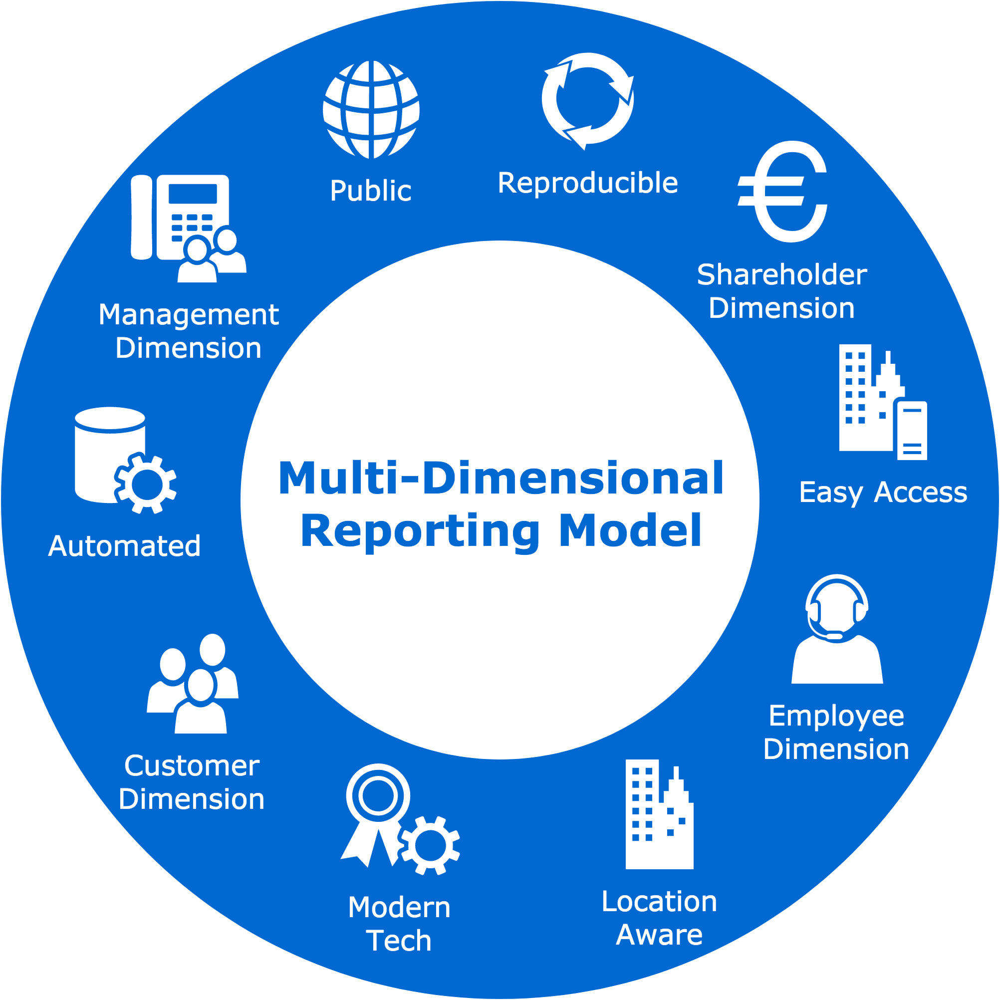

Introduction
============

Why do you need multi-dimensional reporting?
---------------------------------------------

Multi-dimensional reporting is the attempt to combine information from various `publicly available sources <http://4d.readthedocs.io/en/latest/text/quick_start.html#public-sources>`_  to get an understanding of where a company can improve in relation to `close competitors <http://scikit-learn.org/stable/>`_. The Multi-dimensional reporting model (MDRM) is dynamic and currently includes information on employees, customers, managers and shareholders. MDRM's final goal is to act as an input module to an artificially intelligent decision making agent. 

The MDRM has two core objectives:

    * The aggregation and interpretation of all company specific publicly available data. 
    * Intelligent decision making based on interpreted knowledge. 

MDRM has the following qualities:

    * Semi-Automated. 
    * Interactive.
    * Industry Adjusted.
    * Intelligent. 
    * Competitor Specific. 

